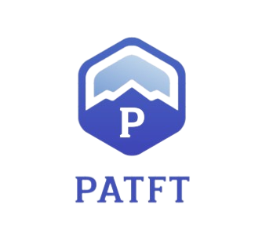
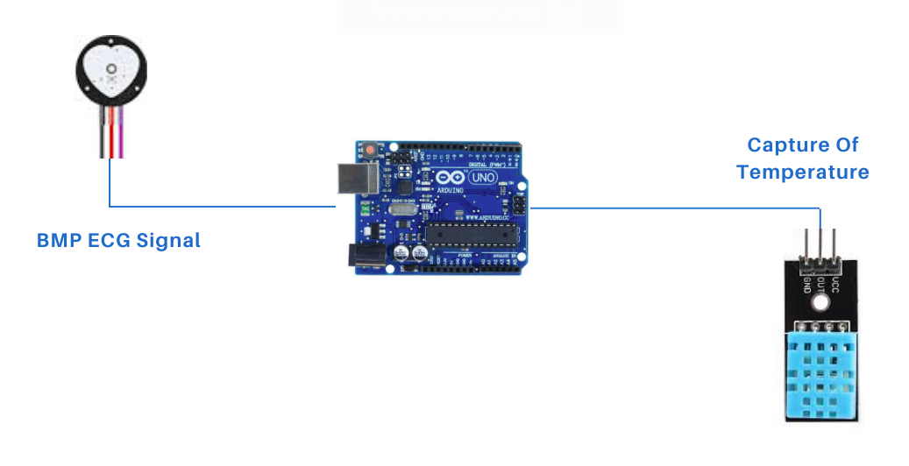
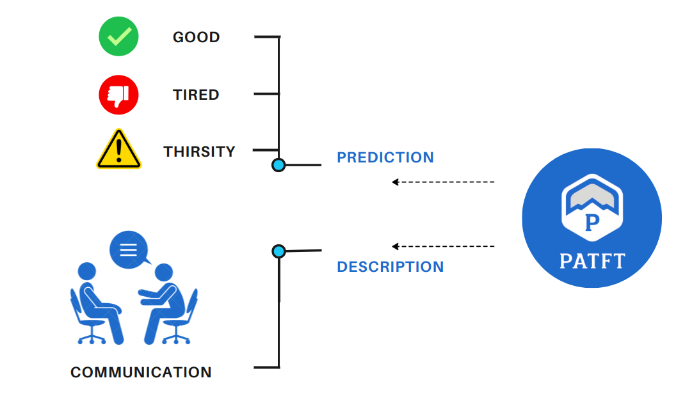
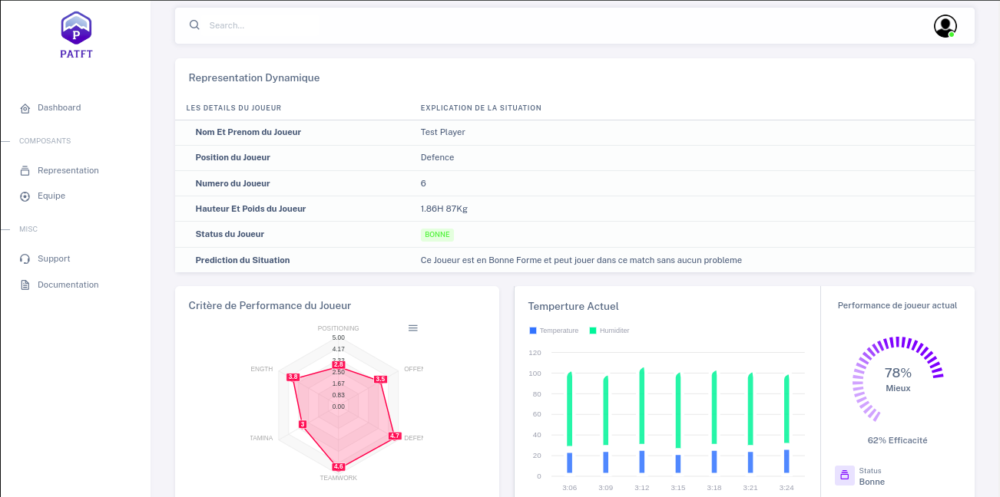

<a name="readme-top"></a>
[![Contributors][contributors-shield]][contributors-url]
[![Forks][forks-shield]][forks-url]
[![Stargazers][stars-shield]][stars-url]
[![Issues][issues-shield]][issues-url]
[![MIT License][license-shield]][license-url]
[![LinkedIn][linkedin-shield]][linkedin-url]

<!-- logo-->
<br />
<div align="center">
  <a href="#">
    
  </a>

  <h3 align="center">Advanced Perfomance Analsysis of Football Player using Machine Learning</h3>
  </h3>

  <p align="center">
    A novel approach for data-driven performance analysis of football players using machine learning techniques
    <br />
    <a href="https://github.com/bouslama-hamza"><strong>Explore the docs</strong></a>
    <br />
    <br />
  </p>
</div>

<!-- ABOUT THE PROJECT -->
## About The Project
<div align="justify">
Our solution involves collecting and analyzing a wide range of data, including player statistics, match performance, and physical attributes, to identify key factors that influence player performance. By developing predictive models and performance metrics, we can provide coaches, scouts, and analysts with valuable tools for evaluating player performance, identifying talent, and making data-driven decisions.
</div>
<br>

<div align="center">
  <a href="#">
    
  </a>
</div>

<br>
<div align="justify">
This solution addresses the limitations of existing detection methods by providing a more accurate and efficient approach to identifying malignant regions in breast cancer images. By focusing on key spectral features, we can improve the model's performance and interpretability.
</div>

<p align="right">(<a href="#readme-top">back to top</a>)</p>

## Project Context
<div align="justify">
We are different Machine Learning to classify the Player status in the football game , adding the mergine with a chatbot to help the user to get the information about the player status and the game status.
</div>
<br>
<div align="center">
    <a href="#">
    
  </a>
</div>
<br>
<div align="justify">
 we can accurately detect and classify malignant regions in medical images, providing a valuable tool for early cancer detection and diagnosis. Our approach combines advanced machine learning techniques with domain-specific knowledge to enhance the accuracy and efficiency of breast cancer detection, ultimately improving patient outcomes and reducing healthcare costs.
</div>
<p align="right">(<a href="#readme-top">back to top</a>)</p>

## Project Results
<div align="justify">
Our solution demonstrates superior performance in terms of accuracy, precision, and recall, achieving an accuracy rate of 96% in prediction of player status. 
</div>
<br>
<div align="center">
    <a href="#">
        
     </a>
</div>
<br>
<div align="justify">
The chatbot also provides accurate and timely information to users, enhancing the overall user experience and engagement. By combining machine learning with chatbot technology, we can deliver a more personalized and interactive experience for users, improving the quality of service and increasing user satisfaction.
</div>
<p align="right">(<a href="#readme-top">back to top</a>)</p>

## Built In Technologie
There are numerous technologies employed in this project's final product, taking into account design, back-end, front-end, and more, but we may concentrate on the most crucial one as the following.

* [![Django][Django.com]][Django-url]
* [![Bootstrap][Bootstrap.com]][Bootstrap-url]
* [![JQuery][JQuery.com]][JQuery-url]
* [![React][React.com]][React-url]

<p align="right">(<a href="#readme-top">back to top</a>)</p>

<!-- GETTING STARTED -->
## How to Use

_The project's concept may seem sophisticated, but the steps for getting started are quite simple._

1. Make sure that connection is really istablished
2. Clone the repo
   ```
   git clone https://github.com/bouslama-hamza/PATFT.git
   ```

3. Go To the Real Time Web App Directory
   ```
   cd Web Application/
   ```

4. Install Django packages
   ```
   pip install -r requirement.txt
   ```
   
5. Make Migrations to launch the data base
   ```
    python manage.py makemigration
   ``` 
   ```
    python manage.py migrate
   ```

6. Run the server
   ```
    python manage.py runserver
    ```


<p align="right">(<a href="#readme-top">back to top</a>)</p>


<!-- CONTRIBUTING -->
## Contributing

Contributions are what make the open source community such an amazing place to learn, inspire, and create. Any contributions you make are **greatly appreciated**.

<p align="right">(<a href="#readme-top">back to top</a>)</p>


<!-- CONTACT -->
## Contact

Hamza Bouslama - [Gmail Account](ham.bousa98@gmail.com)

Project Link: [https://github.com/bouslama-hamza/   PATFT.git](https://github.com/bouslama-hamza/PATFT.git)

<p align="right">(<a href="#readme-top">back to top</a>)</p>

<!-- MARKDOWN LINKS & IMAGES -->
<!-- https://www.markdownguide.org/basic-syntax/#reference-style-links -->
[contributors-shield]: https://img.shields.io/github/contributors/othneildrew/Best-README-Template.svg?style=for-the-badge
[contributors-url]: https://github.com/bouslama-hamza/PATFT/graphs/contributors
[forks-shield]: https://img.shields.io/github/forks/othneildrew/Best-README-Template.svg?style=for-the-badge
[forks-url]: https://github.com/bouslama-hamza/PATFT/network/members
[stars-shield]: https://img.shields.io/github/stars/othneildrew/Best-README-Template.svg?style=for-the-badge
[stars-url]: https://github.com/PATFT/stargazers
[issues-shield]: https://img.shields.io/github/issues/othneildrew/Best-README-Template.svg?style=for-the-badge
[issues-url]: https://github.com/bouslama-hamza/PATFT/issues
[license-shield]: https://img.shields.io/github/license/othneildrew/Best-README-Template.svg?style=for-the-badge
[license-url]: https://github.com/bouslama-hamza/PATFT/blob/main/LICENSE
[linkedin-shield]: https://img.shields.io/badge/-LinkedIn-black.svg?style=for-the-badge&logo=linkedin&colorB=555
[linkedin-url]: https://linkedin.com/in/hamza-bouslama
[Django.com]:https://img.shields.io/badge/Django-0769AD?style=for-the-badge&logo=django&logoColor=white
[Django-url]:https://www.djangoproject.com/
[Bootstrap.com]: https://img.shields.io/badge/Bootstrap-563D7C?style=for-the-badge&logo=bootstrap&logoColor=white
[Bootstrap-url]: https://getbootstrap.com
[JQuery.com]: https://img.shields.io/badge/jQuery-0769AD?style=for-the-badge&logo=jquery&logoColor=white
[JQuery-url]: https://jquery.com 
[React.com]: https://img.shields.io/badge/React-0769AD?style=for-the-badge&logo=react&logoColor=white
[React-url]: https://reactjs.org